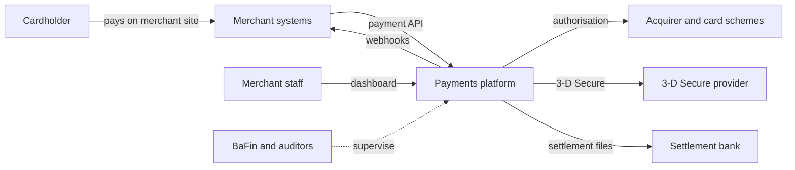
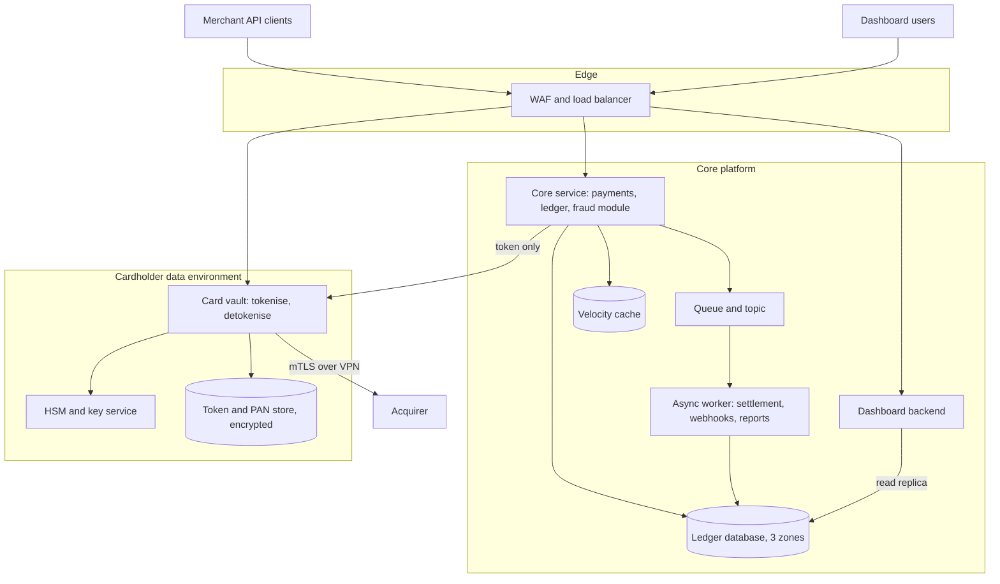
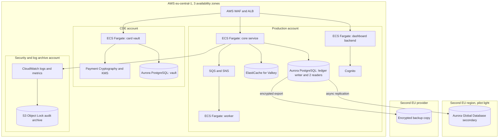
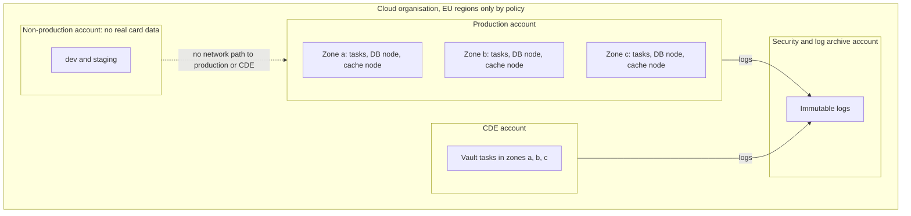
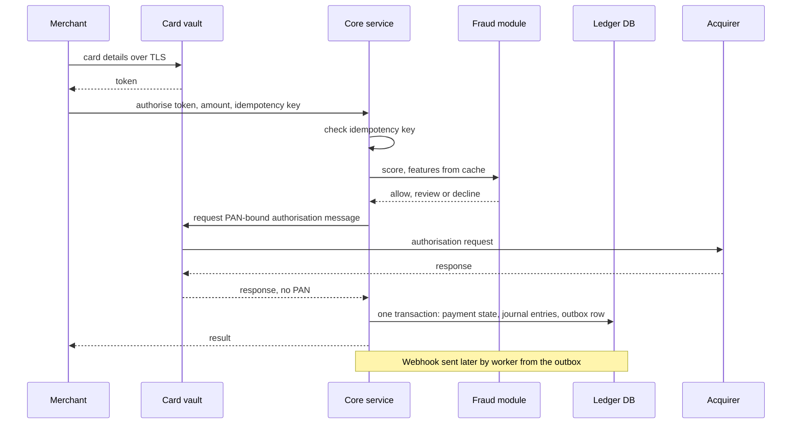

# Diagrams

## 1. System context (neutral)

```mermaid
flowchart LR
  Shopper["Cardholder"] -->|"pays on merchant site"| Merchant["Merchant systems"]
  Merchant -->|"payment API"| Platform["Payments platform"]
  Staff["Merchant staff"] -->|"dashboard"| Platform
  Platform -->|"authorisation"| Acquirer["Acquirer and card schemes"]
  Platform -->|"3-D Secure"| TDS["3-D Secure provider"]
  Platform -->|"settlement files"| Bank["Settlement bank"]
  Platform -->|"webhooks"| Merchant
  Regulator["BaFin and auditors"] -.->|"supervise"| Platform
```

## 2. Containers (neutral)

```mermaid
flowchart TB
  subgraph Edge["Edge"]
    WAF["WAF and load balancer"]
  end
  subgraph CDE["Cardholder data environment"]
    Vault["Card vault: tokenise, detokenise"]
    HSM["HSM and key service"]
    VaultDB[("Token and PAN store, encrypted")]
  end
  subgraph Core["Core platform"]
    API["Core service: payments, ledger, fraud module"]
    Worker["Async worker: settlement, webhooks, reports"]
    Dash["Dashboard backend"]
    LedgerDB[("Ledger database, 3 zones")]
    Cache[("Velocity cache")]
    Queue["Queue and topic"]
  end
  Merchant["Merchant API clients"] --> WAF
  Browser["Dashboard users"] --> WAF
  WAF --> Vault
  WAF --> API
  WAF --> Dash
  Vault --> HSM
  Vault --> VaultDB
  API -->|"token only"| Vault
  API --> LedgerDB
  API --> Cache
  API --> Queue
  Queue --> Worker
  Worker --> LedgerDB
  Dash -->|"read replica"| LedgerDB
  Vault -->|"mTLS over VPN"| Acquirer["Acquirer"]
```

## 3. Containers mapped to AWS (option B)

```mermaid
flowchart TB
  subgraph FRA["AWS eu-central-1, 3 availability zones"]
    WAF["AWS WAF and ALB"]
    subgraph CDEacct["CDE account"]
      Vault["ECS Fargate: card vault"]
      PC["Payment Cryptography and KMS"]
      VDB[("Aurora PostgreSQL: vault")]
    end
    subgraph ProdAcct["Production account"]
      API["ECS Fargate: core service"]
      Wkr["ECS Fargate: worker"]
      Dash["ECS Fargate: dashboard backend"]
      Aur[("Aurora PostgreSQL: ledger writer and 2 readers")]
      VK[("ElastiCache for Valkey")]
      SQS["SQS and SNS"]
      Cog["Cognito"]
    end
    subgraph SecAcct["Security and log archive account"]
      S3[("S3 Object Lock audit archive")]
      CW["CloudWatch logs and metrics"]
    end
  end
  subgraph DR["Second EU region, pilot light"]
    AurDR[("Aurora Global Database secondary")]
  end
  subgraph Second["Second EU provider"]
    Bkp[("Encrypted backup copy")]
  end
  WAF --> Vault
  WAF --> API
  WAF --> Dash
  Dash --> Cog
  Vault --> PC
  Vault --> VDB
  API --> Aur
  API --> VK
  API --> SQS
  SQS --> Wkr
  Aur -->|"async replication"| AurDR
  Aur -->|"encrypted export"| Bkp
  API --> CW
  CW --> S3
```

## 4. Deployment view: accounts and zones

```mermaid
flowchart TB
  subgraph Org["Cloud organisation, EU regions only by policy"]
    subgraph NP["Non-production account: no real card data"]
      Dev["dev and staging"]
    end
    subgraph PA["Production account"]
      Z1["Zone a: tasks, DB node, cache node"]
      Z2["Zone b: tasks, DB node, cache node"]
      Z3["Zone c: tasks, DB node, cache node"]
    end
    subgraph CA["CDE account"]
      CZ["Vault tasks in zones a, b, c"]
    end
    subgraph LA["Security and log archive account"]
      Logs["Immutable logs"]
    end
  end
  PA -->|"logs"| Logs
  CA -->|"logs"| Logs
  NP -.->|"no network path to production or CDE"| PA
```

## 5. Authorisation request flow

```mermaid
sequenceDiagram
  participant M as Merchant
  participant V as Card vault
  participant C as Core service
  participant F as Fraud module
  participant L as Ledger DB
  participant A as Acquirer
  M->>V: card details over TLS
  V-->>M: token
  M->>C: authorise token, amount, idempotency key
  C->>C: check idempotency key
  C->>F: score, features from cache
  F-->>C: allow, review or decline
  C->>V: request PAN-bound authorisation message
  V->>A: authorisation request
  A-->>V: response
  V-->>C: response, no PAN
  C->>L: one transaction: payment state, journal entries, outbox row
  C-->>M: result
  Note over C,L: Webhook sent later by worker from the outbox
```
