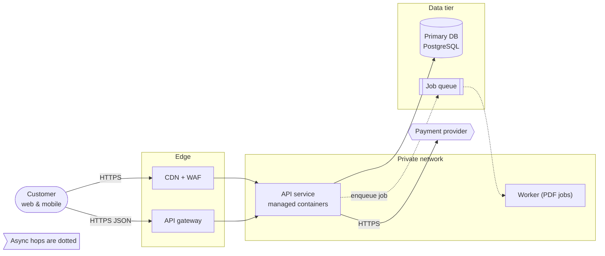
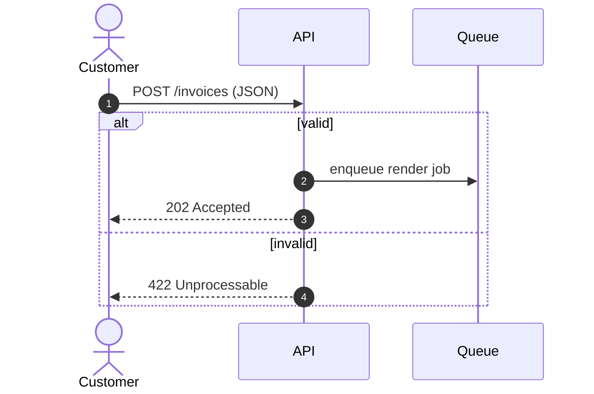
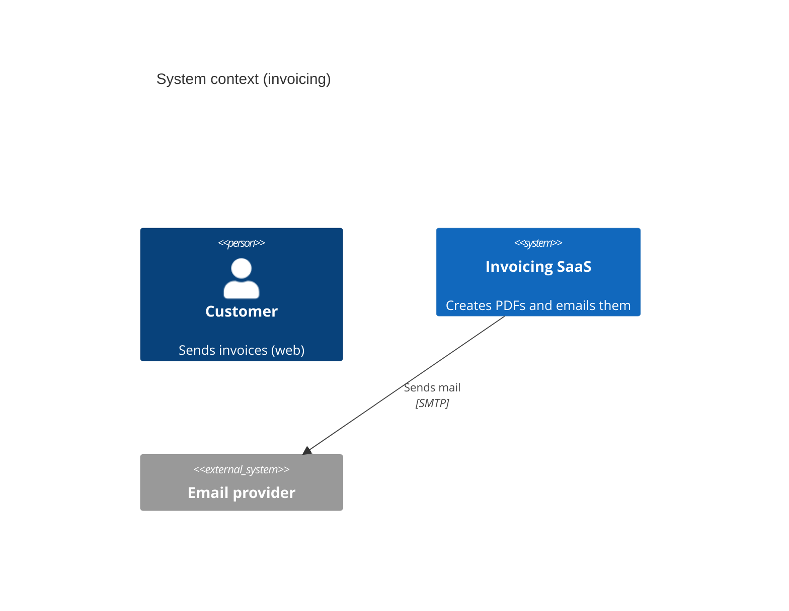

# Sample diagrams (valid)

## Containers — neutral

```mermaid
flowchart LR
  user([Customer<br/>web & mobile])
  subgraph edge[Edge]
    cdn[CDN + WAF]
    gw[API gateway]
  end
  subgraph app[Private network]
    api[API service<br/>managed containers]
    worker["Worker (PDF jobs)"]
  end
  subgraph data[Data tier]
    db[(Primary DB<br/>PostgreSQL)]
    q[[Job queue]]
  end
  pay{{Payment provider}}
  user -->|HTTPS| cdn --> api
  user -->|HTTPS JSON| gw --> api
  api --> db
  api -.->|enqueue job| q -.-> worker
  api -->|HTTPS| pay
  note>Async hops are dotted]
```

## Key flow

```mermaid
sequenceDiagram
  autonumber
  actor U as Customer
  participant A as API
  participant Q as Queue
  U->>A: POST /invoices (JSON)
  alt valid
    A->>Q: enqueue render job
    A-->>U: 202 Accepted
  else invalid
    A-->>U: 422 Unprocessable
  end
```

## Context

```mermaid
C4Context
  title System context (invoicing)
  Person(customer, "Customer", "Sends invoices (web)")
  System(invoicing, "Invoicing SaaS", "Creates PDFs and emails them")
  System_Ext(email, "Email provider")
  Rel(invoicing, email, "Sends mail", "SMTP")
```
